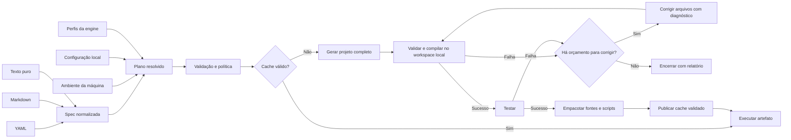

# Plano de organização e entrega do CREXE v1

Data inicial: 2026-09-23. Atualização de escopo: 2026-09-24. Status: execução iniciada em `feature/v1`; resultados e pendências em [IMPLEMENTACAO_V1.md](IMPLEMENTACAO_V1.md). As observações de baseline abaixo permanecem históricas, não descrevem todas as mudanças posteriores.

Ponto de partida preservado: commit de baseline identificado pela tag `baseline/pre-v1`, na branch `feature/v1`, antes da implementação deste plano. O [registro do baseline](BASELINE.md) descreve conteúdo, backup local, exclusões do remoto e comandos de comparação.

## 1. Objetivo e direção

CREXE significa **Creative Executable**. O arquivo `.crexe` carrega a intenção de um aplicativo; a engine interpreta essa intenção no contexto da máquina, gera código, compila, armazena o resultado e executa o aplicativo. Para a comunidade, isso oferece uma especificação aberta e implementável. Para o usuário comum, oferece um documento que pode ser escrito, compartilhado e personalizado sem descrever toda a infraestrutura de compilação.

O baseline desta entrega é exclusivamente o pacote atual em `src/`, conforme a orientação do autor. A experiência em `docs/legado/` é referência histórica e fonte possível de correções isoladas; não deve substituir o baseline. As afirmações contrárias dos handoffs estão desatualizadas.

Decisão do autor, simplificada em 24/09/2026: **na v1, o “sandbox” será apenas uma pasta temporária de trabalho no host do usuário, gerenciada pela engine**. Geração, build, correção e testes usam ferramentas locais, sem exigir Docker, WSL, contêineres ou máquinas virtuais. A pasta organiza os arquivos; não oferece isolamento de segurança dos processos. Essa decisão substitui a proposta anterior de escolher entre host e sandbox Linux ou comprovar isolamento nativo como condição da v1.

A própria engine CREXE gerencia esse workspace e o ciclo completo, sem depender de um sandbox ou de uma plataforma de agentes do fornecedor do modelo. OpenAI e Ollama são providers intercambiáveis de geração de código. O funcionamento completo com Ollama local deve ser possível sem conta, chave ou serviço OpenAI. Isolamento real e seus requisitos de instalação ficam para uma evolução futura.

**Restrição explícita do autor: não usar o produto Windows Sandbox em hipótese alguma nesta fase.** Não instalar, habilitar, iniciar, testar ou invocá-lo como fallback, inclusive por `.wsb`, `WindowsSandbox.exe` ou comandos gerados. Uma possível feature futura exige uma nova decisão; não autoriza seu uso agora. A v1 executa nativamente no host.

Recomendo que a meta da v1 contemple **YAML, Markdown e texto puro**, implementados em etapas após estabilizar o caminho YAML. Os três formatos usam a extensão `.crexe` e alimentam o mesmo fluxo de execução. Essa é uma proposta de escopo, não uma afirmação de suporte existente.

A primeira versão deve fechar um percurso verificável: escrever ou obter uma intenção, resolver o ambiente, gerar um projeto completo, compilar em ambiente controlado, corrigir falhas dentro de limites, testar minimamente, empacotar os fontes e executar. Cache e regeneração após uma edição completam o percurso. O ciclo de correção de build/testes está dentro da v1; Studio, marketplace, monetização e ações autônomas fora desse ciclo permanecem fora do escopo.

## 2. Estado observado

Foram examinados o código completo das duas variantes, seus manifests, exemplos, scripts, READMEs, os três RFCs, handoffs, artigos, manifesto, estratégia e threat model. O autor confirmou que todo o percurso da calculadora ocorreu na mesma máquina original, diferente da máquina desta sessão; esse percurso é evidência funcional do baseline, detalhada abaixo.

- No inventário inicial, `feature/v1` e `main` apontavam para `e78f17c`, e somente `LICENSE` estava rastreado.
- O commit identificado por `baseline/pre-v1` preserva os arquivos do projeto, o plano e as validações antes da implementação. A cópia contextual da outra máquina fica no backup local e fora do Git; detalhes em `docs/BASELINE.md`.
- O baseline tem 854 linhas em `src/src/main.rs`; a variante experimental tem 990. Não há testes automatizados Rust, CI ou `Cargo.lock` nos arquivos entregues.
- `docs/CREXE_HANDOFF.md` e `docs/crexe_handoff_docs/00_HANDOFF.md` são duplicatas idênticas, confirmadas por SHA-256.
- O código atual possui leitura YAML, seleção de target, templates, chamada Chat Completions, geração de arquivos, build/run, fingerprint e invocação direta de `.crexe`.
- O contrato `GeneratedOutput.files` já é uma lista (`src/src/main.rs:75`) e a escrita percorre seus arquivos. A limitação prática a um único fonte vem do prompt do exemplo (`src/examples/calculator_native.crexe:119`) e dos comandos que compilam apenas esse fonte. Ainda faltam planejamento de projeto/dependências, build de múltiplos módulos e ciclo de correção/testes.
- O exemplo do baseline usa C++/Win32 com MinGW no Windows, Objective-C++/Cocoa no macOS e C/GTK3 no Linux. O handoff descreve incorretamente C/MSVC como caminho atual do Windows.
- Rust/Cargo e `g++` não foram encontrados no PATH Windows desta sessão nem nos locais usuais consultados. O baseline foi posteriormente compilado em contêiner Linux, sem alterar os fontes, e passou por uma auditoria de 27 cenários: 13 aprovados e 14 requisitos de robustez não atendidos. A CLI não contém testes Rust próprios (`cargo test`: zero testes). O relatório de validação distingue testes locais, evidências da outra máquina e pendências Windows.
- Nesta máquina, não há associação `.crexe` configurada nem `OPENAI_API_KEY` nos escopos processo, usuário e máquina. Não houve compra de créditos ou chamadas à OpenAI.
- Na avaliação inicial do Ollama, uma chamada mínima ao `gemma4:26b` retornou HTTP 500. Foi instalado `gemma4:12b`, que respondeu ao probe; a calculadora pelo baseline excedeu 180 segundos e um teste menor recebeu JSON incompleto. A [análise adicional do autor](ANALISE_OLLAMA_LOCAL_2026-09-23.md) registra que o 26B depois carregou e respondeu com memória disponível, inclusive a pedidos maiores. Portanto, a falha inicial não significa incompatibilidade permanente do 26B com esta máquina. Os projetos dessa análise não foram compilados e o exemplo Blazor continha erros; ainda falta comprovar o contrato de arquivos e o ciclo completo pela engine.
- Uma [consulta de inventário](validation/2026-09-23-ollama-inventory.json) ao host às 22:46 de 23/09/2026 confirmou Ollama 0.34.2, `gemma4:12b`, `gemma4:26b`, `embeddinggemma:latest` e `qwen3-embedding:0.6b` instalados. Nenhum modelo estava carregado naquele instante. A consulta foi somente de leitura, sem nova geração ou alteração do serviço.
- `docs/legado/TestesDeOutraMaquina/ArquivosCrExe/` é apenas contexto histórico. Foram observados três builds da calculadora com executável, marcador de sucesso e fontes com variações de cor. Não usar esses arquivos como fonte canônica nem incorporar caches de aplicações, dados de navegador ou binários ao projeto público.

### Percurso validado pelo autor na máquina original

Todas as etapas abaixo foram realizadas pelo autor em um único computador, diferente deste:

1. Compilou a engine CLI, preparou `calculadora.crexe` em YAML e executou o `.bat` para associar a extensão à engine compilada.
2. Deu dois cliques no `.crexe`. A engine processou com sua janela de terminal visível; a calculadora abriu e, conforme o relato, o terminal da engine fechou.
3. Reabriu o `.crexe` para edição, acrescentou a intenção de usar fundo verde, salvou e deu dois cliques novamente. A engine gerou outra versão e abriu a calculadora verde.
4. Fechou a calculadora e abriu o mesmo `.crexe` novamente. A versão verde já compilada foi reutilizada, sem outra geração.
5. Inspecionou o cache e confirmou sua criação; não registrou o caminho exato.

O autor também observou que copiar apenas o `.crexe` para outro computador não leva o cache. Preservar essa separação como característica do produto: o documento compartilha a intenção, e os resultados de geração/build pertencem ao ambiente local. Isso não afirma que o ciclo inteiro foi reproduzido em uma segunda máquina nesta sessão. O terminal observado no fluxo original será substituído pela janela de espera planejada.

### Achados que orientam a ordem do trabalho

As referências abaixo apontam para as linhas do baseline antes da reorganização.

| Prioridade | Evidência | Consequência e trabalho necessário |
|---|---|---|
| P0 | `src/src/main.rs:609–655`, especialmente 628–629 | Quando o executável esperado existe, `resolve_run_command` devolve o comando original, possivelmente relativo. A conversão para absoluto prometida no README só está implementada no legado. Recuperar essa correção isoladamente e testar execução a partir de outro diretório. |
| P0 | `src/src/main.rs:464–490` | A escrita cria diretórios antes de verificar contenção e só verifica o pai do arquivo. Falta rejeição explícita de caminhos absolutos, proteção do arquivo final contra links e proteção dos arquivos internos da engine. Validar todos os destinos antes de escrever. |
| P0 | `src/src/main.rs:552–562`, 671–699 | A permissão de execução tem fallback por prefixo textual de `build`; a allowlist permite tudo quando ausente/vazia e compara apenas o nome do comando. A própria receita escolhe a lista, incluindo shells. Isso não constitui isolamento de processos. |
| P0 | `src/src/main.rs:348–350`, 396–399 | A receita escolhe o endpoint e qual variável de ambiente vira Bearer token. Uma receita externa pode direcionar uma credencial local a outro servidor. Credenciais e destinos autorizados devem pertencer à configuração local do usuário. |
| P0 | `src/src/main.rs:592–605` | Build/run herdam permissões e ambiente do processo. `allowNetwork` não é aplicado e os timeouts dessas fases são lidos, mas ignorados. As garantias das RFCs excedem o comportamento implementado. |
| P0 | `src/src/main.rs:191–210`, 742–764, 805–824 | O cache não incorpora o ambiente resolvido nem valida o artefato. Um rebuild reutiliza o diretório sem invalidar os marcadores anteriores; uma falha pode deixar um estado antigo parecendo válido. Faltam transações e proteção contra concorrência. |
| P1 | `src/src/main.rs:174`, 251–306, 323–338 | Não há validação de versão/schema. Tipos dos inputs não são aplicados, seletores inválidos viram `false`, target padrão é Linux e templates desconhecidos permanecem no texto. Erros podem surgir apenas após uma chamada ao modelo. |
| P1 | `src/src/main.rs:229–248`, 702–739 | `ARCH` vem da compilação da engine; não há inventário de toolchains, distinção entre arquitetura do processo e host, nem nome derivado do arquivo. O caminho do arquivo não participa da resolução do app. |
| P1 | `src/src/main.rs:341–453` | O baseline aceita apenas provider `openai-compatible` e usa Chat Completions. `generator.transport`, `generator.mode` e outros campos documentados não têm o significado prometido pela documentação agregada. |
| P1 | `src/build-executor.cmd`, `src/run-example.sh` | O build depende do diretório atual. Os scripts de teste são invocações manuais e alguns forçam nova geração. Tornar caminhos independentes do CWD, preservar códigos de saída e separar testes offline de demonstrações pagas. |
| P1 | `src/Cargo.toml:6`, exemplo e `LICENSE` | O pacote e a receita declaram `UNLICENSED`, enquanto a raiz contém GNU GPL v3. Alinhar metadados à licença escolhida pelo autor e explicitar o alcance de cada licença. |
| P2 | `src/src/main.rs:848–853` | O truncamento de mensagens corta por bytes e pode causar panic em texto UTF-8. Corrigir com um teste que inclua acentos. |

O fingerprint atual já cobre os bytes completos da receita. Portanto, editar qualquer campo do YAML já muda a chave, inclusive campos que o executor ignora. O problema principal é não representar o ambiente e as configurações efetivamente resolvidas, nem garantir a integridade do estado armazenado.

## 3. Escopo proposto para a entrega

### Dentro da v1

- CLI Rust e especificação versionada, com YAML legado compatível, Markdown e texto puro.
- Uma base Rust compartilhada entre Windows, Linux e macOS, com especializações selecionadas por `#[cfg]` e dependências por target no Cargo, sem remover arquivos para compilar em outro sistema.
- `crexe exec arquivo.crexe` e `crexe arquivo.crexe`, preservando a associação e o drag-and-drop do Windows.
- Instalação por usuário em caminho estável para a linha v1, independente do checkout, usada pela associação da extensão e pelos testes de distribuição.
- Janela simples de espera ao abrir pelo desktop, inicialmente no Windows, com “Creative Executable — Gerando seu programa…”, progresso por fase, fechamento ao iniciar o aplicativo e erro visível quando houver falha.
- Descoberta de OS, arquitetura e toolchains; diagnóstico anterior à chamada ao modelo.
- Triagem curta de requisitos por IA quando necessária, neutra em relação ao sistema operacional, integrada ao planejamento quando possível e sem impor uma chamada extra a toda execução. Verificar compatibilidade com o host e suas ferramentas, sem uma classificação host versus contêiner.
- Perfis de geração/build mantidos pela engine e selecionados deterministicamente.
- Texto puro como prompt livre, inclusive uma única frase, sem seções ou metadados obrigatórios.
- Projetos com múltiplos fontes, recursos, dependências, scripts de build e testes, com exportação de um ZIP utilizável.
- Contrato de entrega completa aplicado pela engine, mesmo quando a intenção não pede um ZIP; operações padronizadas de build, run, test, publish e export, com scripts portáveis dentro de cada target.
- Orquestração e execução local gerenciadas pela própria engine para gerar, compilar, observar falhas, corrigir e testar em uma pasta temporária por execução, com timeouts, cancelamento, limites de geração/logs e publicação transacional do cache. O host é o modo padrão da v1, sem configuração de backend adicional nem dependência de Docker/WSL. Nenhum sandbox do provider é necessário; Windows Sandbox é proibido.
- Configuração local de provider, endpoint, modelo e credenciais; **OpenAI e Ollama local como providers da v1**. Preservar Chat Completions no caminho atual e implementar o adaptador Ollama com controle de recursos locais.
- Etapas inspecionáveis, cache confiável, erros claros e limites realmente aplicados ou explicitamente não suportados.
- Exemplos dos três formatos, testes offline, demonstração real documentada e binários para as plataformas efetivamente verificadas.
- README público, RFCs coerentes com o código, guia de contribuição e conteúdo preparado para `crexe.org`.

### Fora do requisito de fechamento

- Recuperar a tentativa com Responses/GPT Pro. Pode voltar como transporte separado depois, com testes e documentação própria; não bloqueia a v1.
- Integração com sandboxes hospedados por fornecedores de modelos. A v1 usa o ciclo e a camada de execução gerenciados pelo CREXE.
- Backends de contêiner/VM, dependências Docker/WSL, seleção automática entre ambientes e isolamento de segurança dos processos. Avaliar em versão futura, sem bloquear a v1; controles básicos de arquivos e subprocessos continuam dentro do escopo.
- Windows Sandbox: proibido em toda a fase atual, inclusive para desenvolvimento, testes, instalação e fallback. Não oferecer como backend opcional da v1.
- Studio visual, marketplace, contas, assinaturas de receitas, instalação automática de compiladores no host e atualização automática. A preparação de dependências do projeto no workspace faz parte do build local, com caches das ferramentas documentados. Modelos locais por Ollama estão dentro do escopo; integração com outros runtimes locais pode vir depois.
- Suporte irrestrito a qualquer linguagem, sistema ou arquitetura; cross-compilation implícita; reparo ilimitado de código por novas chamadas ao modelo.
- Promessa de resultados idênticos a cada geração. Cache reutilizável é diferente de geração e builds reproduzíveis.
- Menu de contexto com a ação “Publish”. Preparar a operação interna e a CLI na v1; a integração adicional do Explorer pode vir depois, reutilizando a mesma operação.

Windows x64 deve ser o primeiro percurso validado, por corresponder ao baseline e aos scripts existentes. Os targets macOS e Linux devem ser preservados e ganhar validação própria. Suporte estável publicado depende de teste real para cada combinação de OS, arquitetura e perfil; detecção de x86/ARM64 não significa suporte de build nessas arquiteturas.

## 4. Organização proposta do repositório

Começar com um único pacote Rust na raiz, contendo biblioteca interna e CLI. Não há necessidade atual de um workspace com vários crates.

```text
crexe/
  Cargo.toml
  Cargo.lock
  LICENSE
  README.md
  CONTRIBUTING.md
  SECURITY.md
  CHANGELOG.md
  .gitignore
  .gitattributes
  .github/workflows/
    ci.yml
    release.yml
  src/
    main.rs
    lib.rs
    cli.rs
    config.rs
    installation.rs
    progress.rs
    presentation/
      mod.rs
      console.rs
      windows.rs
      linux.rs
      macos.rs
    format/
      mod.rs
      yaml.rs
      markdown.rs
      text.rs
    spec.rs
    environment.rs
    profiles.rs
    template.rs
    generator/
      mod.rs
      chat_completions.rs
      ollama.rs
    cache.rs
    workspace.rs
    executor.rs
    policy.rs
    project.rs
    pipeline.rs
    artifacts.rs
  profiles/
  examples/
    yaml/calculator.crexe
    markdown/calculator.crexe
    text/calculator.crexe
  tests/
    fixtures/
    cli.rs
    formats.rs
    execution.rs
    cache.rs
    boundaries.rs
  scripts/
    windows/
    unix/
  docs/
    README.md
    getting-started.md
    architecture.md
    platforms/README.md
    configuration.md
    compatibility.md
    roadmap.md
    rfcs/
    essays/
    decisions/
    archive/
  website/
```

Criar os módulos conforme forem extraídos, sem arquivos vazios só para cumprir a árvore. Os perfis oficiais podem ser recursos embutidos no binário para manter a distribuição da CLI simples; a pasta guarda suas fontes versionadas.

### Base compartilhada e especializações por sistema

Usar o mecanismo padrão de Rust/Cargo para manter uma única implementação: `#[cfg(target_os = "windows")]`, `#[cfg(target_os = "linux")]` e `#[cfg(target_os = "macos")]` selecionam os módulos no build, e as seções de dependências por target mantêm as bibliotecas específicas no destino correto. Não exigir que o usuário apague arquivos ou comente código para compilar em outra plataforma. A organização, exemplos e instruções ficam no [README de plataformas](platforms/README.md), com links para a documentação oficial.

O núcleo de interpretação, configuração, providers, projetos, cache e pipeline é compartilhado. Separar as integrações específicas de janela/console, associação, instalação e controle de subprocessos nos módulos correspondentes. `workspace.rs` gerencia as pastas de trabalho e `executor.rs` executa as ferramentas locais; não criar módulos de isolamento sem implementação prevista na v1. `progress.rs` define eventos comuns; `presentation/mod.rs` apresenta uma interface comum para os módulos de console e UI. Evitar tipos Windows na interface usada pelo núcleo. Uma biblioteca de UI multiplataforma pode compartilhar ainda mais código, mantendo separadas as integrações do sistema.

Entregar inicialmente a janela Windows sem impedir a compilação da CLI Linux/macOS. Só declarar módulos quando seus arquivos existirem; interfaces ainda indisponíveis retornam diagnóstico explícito. Se a UI introduzir dependências gráficas, usar features/dependências opcionais do Cargo para permitir um build apenas de CLI em ambiente sem desktop. A documentação de suporte deve distinguir engine compilável, CLI validada, janela disponível e perfis de build local validados por sistema. Não confundir portabilidade dos fontes com um único executável universal ou com cross-compilation já preparada.

### Destino dos arquivos atuais

| Origem | Destino ou tratamento |
|---|---|
| `src/Cargo.toml` e `src/src/main.rs` | Manifest na raiz e fonte em `src/`, primeiro preservando o comportamento; depois extrair módulos. |
| `src/README.md` | Guia técnico revisado e informações úteis incorporadas ao README principal; histórico de patches no arquivo histórico. |
| `src/examples/` | `examples/yaml/`, preservando o exemplo original como fixture de compatibilidade. |
| Scripts `.cmd` e `.sh` | `scripts/windows/` e `scripts/unix/`; manter CMD no Windows e ajustar referências. |
| RFCs 01, 02 e 03 | `docs/rfcs/0001-format.md`, `0002-execution-security.md`, `0003-generators.md`, com status e comportamento implementado. |
| Documento 10 de schema | Exemplo normativo alinhado à especificação e coberto por validação automática. |
| Artigos 04/05, manifesto 06 e ensaio 07 | `docs/essays/`, com manifesto ligado pelo README e distinção entre visão e capacidade presente. |
| Estratégia 08 | `docs/archive/product-strategy-2026-09.md`, identificada como discussão histórica, não política atual do projeto. |
| Threat model 09 | Documento vivo referenciado pela RFC de execução e pelo `SECURITY.md`. |
| Dois handoffs idênticos | Preservar uma cópia em `docs/archive/`, rotulada como histórica e corrigida por uma nota de contexto. |
| Executor experimental completo | Preservar inicialmente em `docs/archive/experiments/responses/`, excluído do build e da documentação de uso. Só retirar após garantir uma cópia recuperável. |
| `docs/legado/TestesDeOutraMaquina/` | Referência local não canônica. Preservar os originais fora da publicação; registrar apenas a síntese das evidências e, se necessário, fixtures mínimas revisadas. |

Na raiz, o `.gitignore` deve excluir artefatos de compilação, caches, segredos locais e a cópia contextual `docs/legado/TestesDeOutraMaquina/`, mas rastrear `Cargo.lock` da aplicação CLI. Preservar a cópia contextual localmente: ignorar não significa apagar. O `.gitattributes` deve explicitar finais de linha apropriados para Rust/Markdown/shell e CMD. Unificar a versão da engine com o pacote, evitando a constante independente `1.0-rust`.

### Instalação estável da engine v1 e associação de arquivos

Adotar a seguinte convenção CREXE para o caminho público da engine instalada. São caminhos propostos para o projeto, não uma afirmação de que os sistemas os criam automaticamente:

| Ambiente | Executável instalado da linha v1 |
|---|---|
| Windows, usuário atual | `%LOCALAPPDATA%\CREXE\releases\v1\crexe.exe` |
| Linux, usuário atual | `${XDG_DATA_HOME:-$HOME/.local/share}/crexe/releases/v1/crexe` |
| macOS, usuário atual | `~/Library/Application Support/CREXE/releases/v1/crexe` |
| Eventual imagem de contêiner, fora da entrega v1 | `/opt/crexe/releases/v1/crexe` (referência futura) |

No Windows, isso normalmente corresponde a uma pasta dentro de `AppData\Local` do usuário. Resolver o diretório pelo ambiente/sistema, sem gravar o nome de um usuário específico nos scripts do repositório. Um override local `CREXE_HOME` pode definir a raiz da instalação para CI e cenários portáteis; a receita não pode modificá-lo. A referência de contêiner preserva a ideia de portabilidade futura, sem exigir imagem nem runtime de contêiner na v1. Instalação, workspace temporário e cache persistente são locais distintos.

`v1` identifica a linha principal estável; a versão completa, arquitetura e checksum ficam no manifesto de instalação e em `--version`. Atualizações 1.x preservam esse endereço. O instalador publica primeiro em staging, verifica o binário e só substitui a instalação quando puder fazê-lo com segurança; um executável em uso não deve produzir uma instalação parcial. Registrar a versão anterior para recuperação. Isso não exige implementar atualização automática.

Os scripts CMD de instalação e associação devem usar o mesmo resolvedor de caminhos da CLI. O fluxo de desenvolvimento/teste passa a ser: compilar o baseline, instalar no destino padrão e testar a engine instalada. `target/release`, a pasta do checkout e uma pasta de ZIP extraído deixam de ser destinos de associação.

Registrar por usuário o comando de abertura com caminho absoluto e argumentos entre aspas. Forma ilustrativa, expandida para o usuário no momento de registrar:

```text
"<LOCALAPPDATA>\CREXE\releases\v1\crexe.exe" "%1" --ui
```

Preservar `crexe arquivo.crexe`, usado pelo Explorer. A opção proposta `--ui` solicita a janela de espera e deve ser aceita também na invocação direta; não existe ainda no baseline. Ativar esse argumento no instalador junto com sua implementação, preservando a associação direta durante o primeiro incremento. A associação deve ser idempotente, verificar o executável instalado e respeitar a escolha de aplicativo padrão do usuário. `doctor` verifica tanto o caminho registrado quanto a associação efetiva, e explica se ainda falta escolher o CREXE em “Abrir com”. Não apresentar apenas a gravação de uma chave como prova de que o duplo clique funciona.

Ao trocar de máquina, instalar e registrar novamente com os caminhos daquela máquina; não copiar um comando de registro que contém o perfil do computador anterior. O mesmo contrato de diretórios simplifica esse processo, mas não torna binários/cache independentes de OS e arquitetura. Linux/macOS terão integração de desktop própria quando suportada; testes de CI em contêiner, se usados, não validam a associação do Explorer.

Separar instalação da engine, configuração privada, cache de build e projetos exportados. Aplicativos gerados nunca são gravados em `releases/v1`. Desinstalação/remoção de associação só altera entradas pertencentes à instalação correspondente e preserva projetos e configurações salvo ação explícita para removê-los.

### Janela de espera durante a preparação do aplicativo

Requisito do autor para a v1: ao dar dois cliques em um `.crexe`, exibir imediatamente uma janela pequena e simples da própria engine. Composição inicial:

```text
Creative Executable

Gerando seu programa…
```

Adicionar um indicador indeterminado discreto, sem porcentagens ou previsões de tempo inventadas. A janela deve ser legível, respeitar escala de texto/DPI e permanecer responsiva durante chamadas ao modelo e compilação. Não impor uma duração mínima de exibição.

- Abrir a janela antes das operações demoradas. Usar mensagens curtas que acompanhem a fase real: “Preparando…”, “Gerando seu programa…”, “Compilando…”, “Verificando…” e “Abrindo seu programa…”. Os detalhes técnicos ficam no log.
- Em cache hit válido, usar “Abrindo seu programa…” e iniciar imediatamente, sem simular geração.
- Fechar a janela após o início bem-sucedido do aplicativo. Separar a confirmação de criação do processo da espera pelo seu encerramento; o `run_command` atual chama `child.wait()` e não pode ser usado como sinal de fechamento dessa janela. A criação do processo não comprova que a interface do app já ficou pronta; tratar falhas imediatas de inicialização e registrar esse limite.
- Se ocorrer erro de leitura, configuração, provider, build ou inicialização, interromper o indicador e manter uma mensagem compreensível, com acesso aos detalhes e opção de fechar. Falhas de pré-execução não podem desaparecer junto com um terminal.
- Fechar/cancelar durante a preparação interrompe o trabalho em andamento, encerra os processos pertencentes à execução e impede a abertura posterior do aplicativo. Após a transferência para o app iniciado, fechar a apresentação não deve encerrá-lo.

A janela pertence à engine e usa mensagens mantidas pelo CREXE; funciona com qualquer formato e provider, inclusive Ollama. O pipeline emite eventos de fase, falha, cancelamento e início do app; uma camada de apresentação os consome sem bloquear sua thread de interface. A CLI em terminal continua com saída textual e códigos de saída, e o modo headless não exige desktop. Solicitar `--ui` onde não há suporte deve produzir diagnóstico claro.

Manter o código específico de Windows em `presentation/windows.rs`, protegido por compilação condicional e com dependências declaradas apenas para esse target. O pipeline e o contrato de progresso permanecem compartilhados; Linux/macOS recebem implementações próprias ou uma apresentação multiplataforma conforme forem validados. Seguir o README de plataformas em vez de instruções para remover arquivos manualmente.

No Windows, validar o modo de inicialização/console da distribuição para que a abertura pelo Explorer mostre somente a janela de espera e, depois, o app, sem terminais extras da engine ou dos subprocessos de build. Preservar o funcionamento da CLI e de aplicativos de console, que podem precisar de seu próprio terminal. A implementação da janela e os ajustes de inicialização ainda fazem parte do trabalho da v1; não estão presentes no baseline. A interface mínima não altera o escopo de Studio ou editor visual.

## 5. Três formatos e uma representação interna



Separar três conceitos: **versão da especificação**, **formato de escrita** e **versão da engine**. YAML, Markdown e texto são formas de expressar a mesma intenção, não três engines ou três pipelines independentes.

O parser produz uma estrutura tipada, mantendo origem e localização dos erros. A resolução combina intenção, inputs, configuração e ambiente em um plano completo. Somente um plano válido chega ao gerador ou ao executor.

### Regra de detecção proposta

1. Uma opção explícita `--format auto|yaml|markdown|text` resolve ambiguidades; `auto` é o padrão.
2. Markdown estruturado começa com front matter delimitado por `---` e um marcador CREXE, por exemplo `crexe: 1`. O corpo inteiro é a intenção em Markdown.
3. YAML usa uma raiz de especificação reconhecível, com `version` e campos estruturais CREXE. A RFC deve definir exatamente os sinais reservados e os casos de erro, preservando `version: 1.0` do exemplo existente.
4. Conteúdo sem marcador estrutural é texto puro e usa a versão padrão documentada, inicialmente v1. Um título, uma lista ou dois-pontos isolados não bastam para inferir uma especificação YAML.
5. Uma entrada identificada como estruturada, mas inválida, retorna erro. Não tentar reinterpretá-la silenciosamente como prompt de texto.

Markdown sem front matter pode ser fornecido com `--format markdown`; em modo automático, continua aproveitável como texto de intenção, preservando a formatação. Markdown e texto comum se sobrepõem: não há detecção infalível sem convenções. O marcador dá previsibilidade para arquivos compartilhados.

Validar também arquivos vazios, BOM, CRLF/LF, UTF-8, limites de tamanho, delimitadores incompletos, versão não suportada e campos desconhecidos. O parser não precisa de LLM ou rede para reconhecer o formato.

### Exemplos de experiência pretendida

Texto puro em `minha-calculadora.crexe`:

```text
gerar uma calculadora simples
```

Outro arquivo, `regra-de-tres.crexe`, pode conter somente:

```text
gerar uma calculadora de regra de 3
```

**O plaintext é somente a intenção livre do usuário.** Não exige títulos, seções, palavras-chave, front matter, listas de campos, nome de aplicativo no texto ou descrição da tecnologia. Um parágrafo mais longo também é válido, sem mudar esse contrato. Não criar seções obrigatórias como “Objetivo”, “Build”, “Dependências” ou “Sistema operacional” para esse formato.

Essas frases são entradas completas. A engine assume nome, OS, arquitetura, linguagem, organização do projeto, build e resolução de dependências. Conforme a definição original do autor, o nome do arquivo sem `.crexe` fornece o nome padrão do app; não é preciso pedir esse dado ao usuário nem gerar um nome aleatório. Provider e credencial vêm da configuração local previamente preparada.

Separar a leitura do texto da interpretação da intenção: o parser preserva o prompt integral; a engine resolve fatos da máquina e um perfil de geração, e o modelo pode propor a estrutura e dependências específicas do projeto dentro desse perfil. O resultado passa por validação antes do build. Para a intenção simples, usar defaults documentados e prosseguir; requisitos incompatíveis devem gerar diagnóstico claro, sem exigir que o usuário reescreva o prompt como YAML.

Markdown estruturado, como proposta de sintaxe a formalizar na RFC:

```markdown
---
crexe: 1
name: Minha Calculadora
---
# Objetivo
Uma calculadora desktop simples.

## Comportamento
- Quatro operações.
- Limpar o resultado.
- Tratar divisão por zero.
```

O corpo inteiro é o prompt de intenção; títulos de seção não impõem uma linguagem de programação disfarçada. Metadados são opcionais além do marcador. O YAML completo continua disponível para autores que precisam de mais controle.

### Compatibilidade do YAML existente

- Criar um adaptador do schema atual para a representação normalizada.
- Preservar `prompt_core`, inputs, seletores válidos, targets explícitos e as duas formas de invocação.
- Definir quais campos são implementados, descontinuados ou rejeitados. Nenhum campo de segurança deve ser aceito com efeito silenciosamente nulo.
- Manter `--rebuild` como regenerar e recompilar, conforme o baseline; um futuro comando de build isolado não deve chamar o modelo novamente.
- Alterações necessárias para fechar falhas de segurança precisam de mensagem de migração. Compatibilidade sintática não concede à receita autoridade sobre a máquina.

## 6. Ambiente, configuração e perfis recomendados

O modo texto exige que a engine assuma responsabilidades que hoje estão escritas no YAML. Ela precisa saber mais que a linguagem: compilador, framework de UI, arquivos esperados, argumentos, saída e condições de compatibilidade compõem um **perfil de aplicação**.

### Origem dos parâmetros

| Parâmetro | Origem proposta |
|---|---|
| Intenção e comportamento | Corpo do documento ou `prompt_core` do YAML. |
| Nome exibido | Override explícito, metadado do arquivo ou nome do arquivo sem `.crexe`. |
| Identificador do artefato | Derivado do nome com regras de caracteres e tamanho; separado do nome exibido. |
| OS e arquitetura | Detecção local; distinguir arquitetura do host, processo da engine e target do compilador. |
| Toolchain e framework disponíveis | Sondagens controladas de ferramentas conhecidas, caminhos e versões. |
| Ambiente de build/teste/run | Host local na v1; o perfil precisa ser compatível com seu OS/arquitetura e ferramentas. A engine define o workspace temporário e os comandos permitidos. |
| Perfil/language | Preferência explícita compatível, configuração local ou tabela oficial da engine. |
| Organização do projeto e dependências | Planejamento da engine com proposta do gerador, validada contra o perfil e resolvida por ferramentas de build/pacotes no ambiente de execução. Não exige campos no plaintext. |
| Provider/modelo | Perfil local de geração; a receita pode sugerir opções compatíveis, sem acessar segredos. |
| Endpoint e credencial | Configuração local confiável; a receita não escolhe uma variável arbitrária de ambiente nem o destino de uma chave. |
| Workspace/cache | Diretórios geridos pela engine/configuração local, sem redirecionamento arbitrário pela receita. |
| Permissões | Política local e permissões concedidas; o arquivo pode pedir menos, nunca se autorizar mais. |

Para opções comuns, documentar precedência: CLI explícita > metadados da receita > preferências locais > defaults. Fatos da máquina não podem ser falsificados por inputs, e essa precedência não se aplica a segredos nem a restrições de segurança.

Normalizar aliases de arquitetura (`x86`/`i686`, `x64`/`x86_64`, `arm64`/`aarch64`) e informar combinações incompatíveis. Não assumir que a arquitetura do binário Rust identifica sempre a arquitetura física do host, especialmente sob emulação.

### Tabela inicial proposta

| Sistema | Perfil inicial | Alternativa prevista | Condição de seleção |
|---|---|---|---|
| Windows | C++17 + Win32 + MinGW-w64 | C# + .NET + Windows Forms | Preservar o perfil comprovado pelo autor; adicionar e testar o perfil .NET com SDK e target compatíveis. |
| macOS | Objective-C++ + Cocoa + clang++ | Outros perfis em evolução posterior | Ferramentas de desenvolvimento e SDK adequados disponíveis. |
| Linux | C + GTK3 + GCC/pkg-config | Outros perfis em evolução posterior | Compilador, bibliotecas e ambiente gráfico compatíveis disponíveis. |

Tratar essa tabela como decisão do projeto, baseada nos exemplos existentes. C#/.NET é uma ampliação proposta, ainda sem implementação entregue. Recomendo incluí-la como segundo perfil Windows após fechar o primeiro percurso com C++.

A ordem é determinística e visível em `inspect`. Considerar as ferramentas instaladas no host para o target. Se só um perfil compatível está disponível, usá-lo. Se vários existem, usar a preferência/configuração ou a ordem oficial; se os requisitos já conhecidos não podem ser atendidos, explicar a falta antes de consumir tokens. Quando a intenção ainda precisar de interpretação, a triagem curta descrita abaixo pode anteceder a resolução final, sem iniciar a geração completa de código. Não instalar compiladores no host silenciosamente. Comandos e dependências propostos pelo modelo passam por uma representação estruturada e pela política da engine; sua mera presença no texto não os autoriza.

O target é o ambiente onde o aplicativo será usado; por padrão, corresponde ao host. Toolchain, ABI, bibliotecas e capacidade de testar esse target precisam estar explícitas no perfil. Uma solicitação incompatível com o host recebe diagnóstico, sem iniciar outro sistema operacional ou prometer cross-compilation implícita.

O perfil precisa declarar a classe de aplicação que suporta. No primeiro ciclo, os perfis são de utilitários desktop simples; uma receita que exija capacidades fora deles deve receber diagnóstico claro, sem promessa de atender qualquer aplicativo.

### Execução no host e compatibilidade do perfil

Na v1, build, testes e execução usam o host do usuário. A engine cria a pasta de trabalho e resolve as ferramentas disponíveis; o usuário não escolhe nem instala um backend de sandbox. Esse é o fluxo padrão, não um fallback depois de falhar um ambiente isolado. Docker, WSL, VMs e isolamento nativo não participam da resolução da v1.

1. Interpretar a intenção e resolver target/perfil com regras locais e, quando necessária, triagem curta por IA. Validar requisitos sugeridos contra perfis conhecidos e inventário local, sem aceitar comandos de sondagem arbitrários.
2. Verificar OS/arquitetura, toolchain/versão, SDK/bibliotecas, sessão gráfica, serviços e dispositivos necessários. “Driver instalado” não substitui o SDK/API de desenvolvimento.
3. Confirmar que o perfil pode compilar e validar o aplicativo neste host. Se não puder, indicar o requisito ausente ou a plataforma incompatível; não trocar a intenção, criar contêineres nem tentar outro SO automaticamente.
4. Registrar em `inspect` o workspace, target, ferramentas e controles realmente aplicados. Não solicitar uma escolha de host versus sandbox a cada execução; essa escolha já está definida para a v1.
5. Revalidar dependências reveladas durante a geração antes de executar seus comandos. Não elevar privilégios nem instalar/alterar ferramentas globais silenciosamente. Windows Sandbox permanece proibido.

Perfis futuros podem aproveitar Unity, SDKs de biometria ou impressão instalados, mas esses exemplos não ampliam a matriz prometida da v1. Registrar “compilou”, “passou em mocks” e “validado no equipamento real” separadamente, mesmo que todas as etapas ocorram no mesmo host.

### Triagem curta de requisitos e tempo até abrir o aplicativo

Diretriz do autor: não aumentar desnecessariamente o tempo de geração. O host é o único ambiente de execução previsto na v1; a triagem identifica compatibilidade e dependências, não decide onde criar um sandbox. Preservar o build real e os testes mínimos exigidos pelo perfil. Quando houver integração física, testar a lógica com mocks no mesmo host pode ser útil, sem duplicar o build por padrão.

Para intenções que precisem de análise semântica, prever uma chamada inicial curta ao provider configurado. Sua função é classificar requisitos, sem gerar o projeto inteiro ou decidir permissões. Pergunta interna proposta:

> Esta intenção exige um sistema operacional específico, APIs nativas, SDKs, ferramentas, serviços ou dispositivos do ambiente do usuário? Identifique o sistema e os requisitos por etapa: compilação, testes e execução. Diferencie o que foi explicitamente pedido do que você inferiu; se não houver informação suficiente, indique a dúvida. Responda somente com a classificação estruturada solicitada, sem código nem comandos.

O resultado identifica: restrição de SO (`identificada`, `não identificada` ou `desconhecida`), sistemas aplicáveis, requisitos com sua etapa e origem (explícita/inferida), recursos necessários do host e pendências. A triagem deve tratar Windows, macOS, Linux e requisitos independentes de SO; não reduzir a pergunta a “precisa de Windows?”. Uma resposta “não identificada” não significa compatibilidade comprovada com Linux e não muda o target padrão do usuário.

Percurso para reduzir chamadas e tempo:

1. Verificar cache de aplicativo válido antes da triagem. Reabrir uma versão válida não chama o modelo para reclassificar a mesma intenção.
2. Usar dados explícitos e perfis conhecidos quando forem suficientes; não fazer uma chamada só para confirmar uma decisão já resolvida. Se houver análise inicial necessária e nenhum resultado reutilizável, fazer no máximo uma chamada de triagem por resolução.
3. Se uma chamada de planejamento antes da geração já for necessária, incluir a classificação nessa mesma resposta, sem uma segunda etapa de IA equivalente. Confirmar compatibilidade com o host antes de gerar código quando isso ainda depender da classificação.
4. Pedir resposta pequena e validá-la contra um schema. Limitar tokens, tempo e tamanho da resposta; contabilizar a chamada no orçamento total. Timeout, saída truncada ou inválida produzem estado de requisito desconhecido e diagnóstico, sem uma cadeia automática de reparos do classificador.
5. Usar por padrão o provider/modelo já configurado, aproveitando o carregamento existente quando disponível. Não carregar um segundo modelo Ollama só para essa etapa sem medir o efeito em tempo e memória; uma resposta curta não elimina o custo de carregar o modelo.
6. Guardar a classificação junto do plano, vinculada à intenção, target/contexto relevante, versão do contrato de classificação e identidade do classificador. Revalidar os fatos atuais e a política local antes de reutilizá-la; esse cache não concede permissões e não substitui a validação do cache de aplicativo.

O inventário enviado à triagem deve ser um resumo mínimo de capacidades relevantes, sem credenciais nem conteúdo pessoal. A engine compara a classificação com as ferramentas e recursos realmente disponíveis e aplica sua política local de comandos e dependências. Uma sugestão da IA não autoriza elevação de privilégios nem uso de Windows Sandbox. Se os arquivos/manifests gerados introduzirem requisitos adicionais, revalidar antes do build, sem depender apenas da classificação inicial.

Medir tempo de carregamento do modelo, triagem, planejamento/geração, preparo do workspace, build, testes e abertura, além de chamadas/tokens e reutilização de cache. Comparar uma geração simples, requisitos explícitos de OS compatível/incompatível, uma integração com hardware e uma reabertura por cache. Usar essas medições para ajustar os limites; não prometer uma duração fixa antes de testar os providers e a máquina. Otimizar removendo chamadas e trabalho redundantes, sem retirar verificações necessárias.

### Providers intercambiáveis: OpenAI e Ollama

Ollama é um requisito explícito do autor para a v1. Separar `provider` (serviço), `transport` (protocolo) e `model` (modelo selecionado). O endpoint compatível permite avaliar o baseline, mas recomendo um adaptador da API nativa do Ollama para controlar contexto, carregamento, saída estruturada e thinking, normalizando o resultado para o mesmo contrato `files[]`. Não copiar a implementação experimental de Responses para resolver esse problema.

O Ollama documenta o endpoint local compatível `/v1/chat/completions` e informa que não exige autenticação local. A exigência de uma variável de chave no baseline é uma limitação da engine que deve ser removida para esse provider. Fontes: [compatibilidade OpenAI no Ollama](https://docs.ollama.com/api/openai-compatibility) e [autenticação](https://docs.ollama.com/api/authentication).

Proposta de configuração local em `config.toml` (sintaxe a implementar, não suportada pelo baseline):

```toml
version = 1
default_provider = "local"

[providers.local]
kind = "ollama"
transport = "ollama_chat"
base_url = "http://127.0.0.1:11434"
model = "gemma4:12b"
auth = "none"
timeout_seconds = 300
max_output_tokens = 4096
context_tokens = 4096
thinking = false
keep_alive = "2m"

[providers.openai]
kind = "openai"
transport = "chat_completions"
base_url = "https://api.openai.com/v1"
model = "MODELO_CONFIGURADO_PELO_USUARIO"
auth = "bearer"
api_key_env = "OPENAI_API_KEY"
timeout_seconds = 180
max_output_tokens = 4096
```

Definir um caminho por usuário, como `%APPDATA%/CREXE/config.toml` no Windows e o diretório de configuração apropriado nos demais sistemas, mais `--config` para seleção explícita. `--provider` e `--model` permitem trocar o perfil sem editar a intenção do aplicativo. A configuração privada e quaisquer arquivos de secrets ficam fora do Git; os exemplos públicos contêm apenas referências e placeholders.

Se houver necessidade de `secret` ou outro esquema de autenticação, usar referências explícitas a secrets locais em vez de campos arbitrários copiados para requests. Não exigir uma chave fictícia de quem usa Ollama. A configuração efetiva, sem os valores secretos, deve ser visível em `inspect` e participar da chave de cache.

Preflight local: serviço disponível, modelo instalado, capacidade de geração de texto (não embeddings), parâmetros suportados e erro acionável para memória insuficiente. Timeout local precisa considerar o carregamento do modelo. Um prompt que funciona em chat não comprova conformidade com `files[]`, compilação ou funcionamento do app: esses passos entram nos testes.

O exemplo acima é do adaptador nativo proposto: endpoint-base sem `/v1` e opções explícitas `context_tokens`, `thinking` e `keep_alive`, mapeadas para parâmetros suportados pelo modelo. Os valores são ponto de partida a medir, não uma garantia de desempenho nessa máquina. Durante a avaliação, o probe nativo usou contexto de 2048, enquanto a chamada compatível adotou 16384 no serviço. A [API nativa do Ollama](https://docs.ollama.com/api/chat) permite parâmetros de geração e formato JSON; a [documentação de compatibilidade](https://docs.ollama.com/api/openai-compatibility) orienta configurar contexto por Modelfile quando se usa aquele protocolo.

Detectar término por limite de tokens, resposta incompleta, texto de thinking separado e JSON inválido antes de tocar nos arquivos. Um teste real do baseline recebeu um JSON incompleto; a rejeição funcionou, mas o diagnóstico deve distinguir truncamento de erro de sintaxe e não gastar novas chamadas automaticamente sem limite.

### Evidência adicional do Ollama e implicações para a engine

Usar a [análise local de 23/09/2026](ANALISE_OLLAMA_LOCAL_2026-09-23.md) como evidência complementar, preservando os resultados anteriores em `docs/validation/`. O relatório descreve um host com aproximadamente 32 GB de RAM e RTX 3060 Laptop de 6 GB de VRAM. Seus números são observações de outra sequência de testes, não um benchmark controlado nem uma validação funcional de aplicações.

| Modelo disponível | Evidência e papel possível |
|---|---|
| `gemma4:12b` | Respondeu a Hello World em C/Java. Naquelas amostras, contexto de 16.384 tokens e carregamento dividido em 55% CPU / 45% GPU. Candidato a geração/triagem configurável; código não compilado nesses testes. |
| `gemma4:26b` | Depois de liberar memória, respondeu a Hello World, FastAPI e Blazor. É uma opção utilizável observada nesta máquina, com carregamento sensível à pressão de memória e saída de código ainda sujeita a erros. Não transferir para ele a divisão CPU/GPU medida no 12B. |
| `embeddinggemma:latest` | Gerou embeddings de 768 dimensões; não é substituto de um gerador de código ou classificador conversacional. |
| `qwen3-embedding:0.6b` | Gerou embeddings de 1.024 dimensões; capacidade distinta de geração de texto, sem avaliação de qualidade de busca. |

Requisitos decorrentes desses resultados:

- Manter 12B e 26B selecionáveis por configuração. O `model = "gemma4:12b"` do exemplo é ilustrativo, não uma conclusão de superioridade ou de impossibilidade de usar 26B. Não trocar o modelo automaticamente para recuperar uma falha sem política local explícita.
- Separar disponibilidade do serviço, modelo instalado, modelo carregado, conclusão de uma resposta e projeto realmente compilado/testado. `doctor` consulta metadados por padrão; um diagnóstico comum não deve carregar o 26B silenciosamente apenas para verificar sua existência.
- Distinguir memória em repouso de pico de carregamento. O autor relatou sucesso do 26B após reduzir o uso prévio de RAM para cerca de 9 GB e consumo total de até aproximadamente 25 GB depois de carregado. Não transformar esses valores em limites fixos ou garantias; considerar também a memória da engine, ferramentas de build e ambientes de execução.
- Registrar separadamente carregamento, processamento de prompt e geração. No Java do 26B, o relatório observou 41,19 s no cliente com carregamento de 24,53 s reportado pela API e, depois, 8,07 s totais da API com o modelo já carregado. Isso não isola a influência de streaming e não constitui comparação controlada entre 12B e 26B.
- Reaproveitar o mesmo modelo durante triagem, geração e reparo quando possível, com permanência configurável e respeito ao orçamento de memória. Avaliar o `keep_alive` em relação ao intervalo real de compilação/testes para evitar recargas desnecessárias; não manter modelos indefinidamente nem alternar modelos só para uma triagem curta sem medir o custo. Começar a validação local com uma geração por vez, sem inferir suporte a concorrência a partir desses testes.
- Não encerrar processos do Ollama, descarregar modelos de outras atividades ou fechar aplicativos do usuário como recuperação automática de falta de memória. Diagnosticar a condição e permitir que o usuário ajuste o ambiente/modelo. Cancelar uma execução CREXE não deve matar o serviço Ollama externo.
- Preservar a distinção histórica entre falha de acesso a partir do contêiner de auditoria e falha do serviço no host. Na v1 simplificada, a engine acessa o provider diretamente do host e não requer conectividade de contêiner. Não expor o endpoint de loopback à rede como correção automática de conectividade.
- A análise adicional usou `/api/generate`, sem ajustes de contexto, thinking ou distribuição GPU/CPU enviados pelo agente. Os resultados não validam automaticamente `/api/chat`, o transporte compatível nem os parâmetros de exemplo deste plano. Validar o adaptador escolhido com o contrato estruturado real, término da resposta e arquivos de projeto.
- Conservar compilação e reparo limitado como parte do ciclo: a resposta Blazor concluiu normalmente, mas tinha erros de sintaxe e foi produzida com `stream: false`, como destacou o autor. Esse teste avaliou uma resposta completa sem feedback de ferramentas; não avaliou geração incremental com build e ajuste. Não atribuir os erros à ausência de streaming sem comparação controlada, nem usar esse resultado para concluir que o modelo falharia no fluxo iterativo da engine. Ausência de erro HTTP e texto completo não permitem marcar o projeto como pronto. A saída FastAPI tampouco foi executada.
- Não introduzir embeddings ou RAG no percurso de geração/triagem apenas porque esses modelos estão instalados. Se usados futuramente, preservar a identidade do modelo e a dimensão dos vetores; nenhum resultado aqui valida qualidade semântica ou recuperação.

Próxima evidência necessária: usar prompts, contrato de arquivos, versão de modelo e parâmetros registrados, distinguir partidas a frio e modelo já carregado, e executar de fato geração → build → testes → reparo quando necessário. Medir tempo e memória por fase. Não repetir toda a investigação de hardware nem instalar outros modelos para apenas reler esta análise.

Não fazer fallback silencioso de Ollama para OpenAI: isso enviaria conteúdo e consumiria créditos sem corresponder à escolha do usuário. Downloads de modelos e mudanças de modelo devem ser explícitos. Para esta investigação, o autor autorizou um Gemma menor que 16B caso o maior apresentasse problemas. A biblioteca oficial oferece [Gemma 4 12B](https://ollama.com/library/gemma4:12b); tamanho dos pesos não equivale à memória total necessária.

## 7. Correção do fluxo, cache e limites

### Projetos completos, múltiplos arquivos e pacote de entrega

Evoluir o contrato já existente `files[]` para representar um projeto real. O gerador pode produzir diretórios, módulos de código, headers, recursos de UI, manifests de dependências, lockfiles quando aplicáveis, scripts de build, testes e instruções. A quantidade de arquivos é determinada pelo projeto, dentro de limites de tamanho/quantidade; não impor `src/main.cpp` como toda a aplicação.

Remover dos perfis a obrigação de concentrar todo o código em um arquivo. O perfil define a família de ferramentas e os requisitos do target; o plano de projeto enumera fontes, recursos, dependências, artefatos e comandos de build/teste. Por exemplo, um projeto C++ pode conter `main.cpp`, `calculator.cpp`, `calculator.h`, recursos e testes; um projeto .NET pode conter `.csproj`, múltiplas classes, UI e recursos. O build precisa abranger o projeto, não apenas compilar o primeiro arquivo recebido.

Definir um manifesto interno de projeto que descreva arquivos, entrypoint, perfil, dependências, passos de build/teste e artefatos esperados. Validá-lo separadamente da intenção e das permissões. Scripts gerados fazem parte do resultado e executam no host sob as regras locais da engine. Para projeto maior, avaliar geração em lotes e correções por arquivo com controle de revisão para lidar com os limites de resposta. Suportar múltiplos arquivos é requisito; a divisão desses arquivos entre chamadas ao modelo é decisão de implementação. Nunca aceitar conteúdo truncado como projeto completo.

### Hipótese a avaliar: streaming e geração incremental

O autor esclareceu que receber arquivo por arquivo e intercalar builds era uma suposição sobre um possível fluxo, não uma especificação técnica nem conhecimento do funcionamento interno de um agente em sandbox. A descrição abaixo é uma alternativa proposta para investigação, não uma arquitetura aprovada ou requisito adicional da v1. Cabe à implementação da engine definir a divisão das chamadas, o uso de streaming e os momentos de build com base em testes de qualidade, tempo, custo e memória. Permanecem os requisitos de entregar projetos completos com múltiplos arquivos, compilar/testar de verdade e corrigir falhas dentro dos limites definidos.

Separar três mecanismos: streaming entrega fragmentos da resposta enquanto o modelo gera; geração incremental divide o trabalho em arquivos ou lotes coerentes; o ciclo de ferramentas executa verificações e devolve resultados ao modelo em uma nova rodada. Na [API do Ollama](https://docs.ollama.com/api/streaming), os fragmentos do transporte não representam necessariamente arquivos completos. Habilitar streaming não divide o projeto automaticamente, não reduz por si só a quantidade de código solicitada e não faz a geração em andamento incorporar um erro que o compilador acabou de encontrar. O feedback entra no contexto da próxima chamada.

Uma alternativa a comparar com a geração do projeto completo seguida de build e reparo é este percurso, sem depender de function calling nativo do modelo:

1. Resolver uma estrutura de projeto e interfaces compartilhadas, junto do planejamento já necessário, evitando uma chamada extra apenas para enumerar arquivos em projetos pequenos.
2. Solicitar um arquivo ou pequeno lote coerente por rodada, incluindo o contexto necessário para manter referências, tipos e dependências consistentes. Um projeto pequeno pode caber em um único lote; não obrigar uma chamada por arquivo.
3. Receber a resposta, com streaming quando suportado pelo adaptador, para progresso e cancelamento. Aplicar somente operações completas, com caminhos, contrato, revisão e término validados; uma conexão interrompida ou saída truncada não altera a última revisão aceita. Fragmentos ficam em buffer temporário e nunca são tratados como código pronto para executar.
4. Compilar em marcos com os arquivos e dependências necessários disponíveis. Arquivo recebido não implica projeto compilável: não disparar build a cada token/arquivo nem consumir reparos por dependências que ainda estão planejadas para o próximo lote. Fazer verificações locais mais baratas quando úteis. Começar com geração e build sequenciais, considerando a pressão de memória observada no Ollama.
5. Diante de falha real nesse marco, enviar diagnóstico e fontes relevantes ao modelo na rodada seguinte, corrigir os arquivos necessários e repetir a verificação. Manter o estado do projeto e a versão dos contratos compartilhados; não reenviar ou regenerar todo o projeto sem necessidade.
6. Concluir com build e testes mínimos do projeto completo antes de exportar, publicar o cache de sucesso e abrir o app. Um marco parcial aprovado não comprova a entrega final.

Na v1, as ferramentas executam no host, com arquivos na pasta temporária; a orquestração da engine cria esse ciclo. A mesma divisão em lotes e retorno de diagnósticos pode funcionar sem streaming. Todas as rodadas entram no orçamento global de chamadas, tokens, tempo e correções; o limite não reinicia a cada arquivo. “Uma geração” significa a fase inicial, que pode conter vários lotes, e não necessariamente uma única chamada HTTP.

Na investigação dessa alternativa, validar transporte e estratégia separadamente: comparar streaming ligado/desligado com o mesmo pedido e parâmetros; depois comparar geração completa e incremental com os mesmos requisitos e critérios de aceitação. Registrar estado frio/quente, tempo total até app validado, chamadas, tokens, falhas e reparos. O pedido Blazor do relatório pode servir como caso comparativo quando houver um perfil compatível, sem ampliar os perfis prometidos para a v1. A hipótese é que feedback intermediário e correções localizadas melhorem a entrega; ainda não há medição de ganho de qualidade ou tempo nesta máquina. Não impor lotes extras quando a geração inicial já for pequena e satisfatória. A v1 não precisa implementar ambas as estratégias apenas para atender a esta hipótese; registrar a decisão e a evidência obtida na implementação.

### Exportação do projeto validado

A entrega bem-sucedida inclui uma árvore de fontes e um ZIP com fontes, recursos, scripts de build do target, manifests/lockfiles, instruções de dependências e relatório do build/teste. A engine cria o ZIP a partir do conjunto validado; não é necessário pedir ao modelo que devolva um ZIP em base64. Credenciais, caminhos privados, caches de provider e dados temporários ficam fora do pacote. Binários gerados são artefatos identificados por target e podem ser distribuídos separadamente dos fontes.

Na execução normal por duplo clique, a engine prepara esse projeto e abre o aplicativo; a obtenção do ZIP fica disponível sem obrigar o usuário a compilar manualmente. Exportar o pacote em um diretório vazio e executar seu script de build deve funcionar com os pré-requisitos documentados, sem depender de caminhos do workspace temporário ou de segredos da engine.

### Referência de entrega: SMTP Email Tester

O autor forneceu `SmtpEmailTesterDotNet8.zip`, produzido em uma conversa no ChatGPT a partir de uma intenção de teste SMTP e do pedido de entregar o programa completo em ZIP, com instruções de compilação e execução. O pacote contém um projeto WPF `net8.0-windows`, arquivos C#/XAML separados, README, `.gitignore` e quatro scripts: `build.cmd`, `run.cmd`, `publish-win-x64-self-contained.cmd` e `clean.cmd`. A análise e os resultados locais estão em [validação do pacote SMTP](validation/2026-09-23-smtp-reference.md). Ele é referência de qualidade da entrega, não substitui o baseline Rust nem comprova geração pela engine.

**“Entregar o programa completo, pronto para compilar e executar, com ZIP e instruções” passa a ser um requisito interno do CREXE.** O usuário não precisa repetir essa frase no plaintext. A engine combina a intenção com o contrato de entrega e o perfil resolvido, solicita arquivos completos ao provider e produz o ZIP depois da validação. Pedir apenas código isolado deixa de atender ao contrato. Não exigir que o modelo gere bytes de ZIP ou use ferramentas exclusivas de uma plataforma de chat.

Diretriz interna de geração, a adaptar ao protocolo de cada provider:

> Gere o projeto completo que implementa esta intenção no target e perfil resolvidos. Entregue todos os arquivos de fontes, UI, recursos, configuração de build, dependências e instruções necessários. Preserve a divisão natural em múltiplos arquivos. Respeite o contrato de operações fornecido pela engine e os critérios de aceitação. Retorne os arquivos e metadados no formato estruturado solicitado; a engine executará as verificações e criará o ZIP. Não declare que compilou ou testou sem resultados de ferramentas.

O exemplo informa o formato desejado da entrega, sem fixar WPF, .NET 8 ou uma árvore C# para todas as linguagens. Os perfis escolhem a estrutura idiomática de cada projeto. Quando a intenção explicita uma tecnologia, como .NET 8 neste caso, respeitar esse requisito e verificar sua disponibilidade; a recomendação por OS resolve escolhas não especificadas, sem substituir a preferência explícita silenciosamente.

### Contrato interno de operações e scripts

Versionar o manifesto de projeto gerado separadamente do formato de intenção `.crexe`. Ele registra perfil/target, arquivos, dependências, operações disponíveis, comandos com argumentos estruturados, diretório de trabalho, artefatos de saída e resultados de validação. Esse manifesto é criado pela engine; o autor de um plaintext não precisa escrevê-lo.

| Operação | Responsabilidade |
|---|---|
| `build` | Restaurar as dependências declaradas e compilar o projeto no perfil/configuração definidos, preservando diagnóstico e código de saída. |
| `run` | Iniciar o artefato correspondente à revisão validada. No pacote exportado, o script pode chamar o build quando necessário, conforme o README. |
| `test` | Executar as verificações reais disponíveis. Informar verificações ausentes ou manuais; não criar um script que sempre retorna sucesso para preencher o contrato. |
| `publish` | Produzir a distribuição local do aplicativo para o target e modo selecionados, como `win-x64` self-contained no perfil .NET. Não enviar para site, loja ou servidor. |
| `export` | Empacotar fontes, recursos, scripts, manifests e relatório da revisão selecionada em ZIP, independente de haver um publish binário. |
| `clean` (opcional) | Remover somente saídas declaradas do projeto, com contenção e tratamento de links; não varrer recursivamente qualquer diretório chamado `bin` ou `obj`. |

Os perfis oficiais mantêm templates de scripts e os renderizam a partir do mesmo plano usado pelo executor, evitando comandos divergentes entre a CLI e o pacote. No Windows, usar entradas previsíveis como `build.cmd`, `run.cmd` e `publish.cmd`; variantes explícitas, como `publish-win-x64-self-contained.cmd`, podem complementar a entrada padrão. Em Linux/macOS, usar os equivalentes `.sh` quando o perfil for suportado. Incluir `test` quando houver verificações automatizadas implementadas. Não exigir todos os sistemas operacionais em um projeto específico de Windows.

Os scripts exportados devem funcionar com as ferramentas documentadas, sem exigir CREXE, provider ou chave de API. Devem resolver caminhos a partir da própria localização, citar argumentos, suportar espaços/acentos e propagar falhas. O README descreve pré-requisitos, comandos, saídas, diferença entre build dependente de runtime e distribuição self-contained quando aplicável, além do que foi realmente testado. O relatório registra SDK/toolchain e versões resolvidas; lockfiles e seleção de SDK são incluídos quando aplicáveis ao perfil, sem caminhos privados.

O ZIP deve ter uma pasta raiz identificável e incluir todos os arquivos do projeto; caches, credenciais e saídas intermediárias ficam fora. A engine registra os artefatos de distribuição separadamente, com target e modo de publicação. O script `publish` e um futuro botão direito “Publish” acionam a mesma operação definida no manifesto. A ação do Explorer deverá apontar para a instalação estável da engine, respeitar o target e exibir progresso/erro, sem introduzir outro pipeline.

### Ciclo de gerar, compilar, corrigir e testar

Esse ciclo passa a ser uma responsabilidade central da engine, funcionando com OpenAI e Ollama:

1. Verificar reutilização válida e resolver intenção, nome, target, perfil, ferramentas locais e orçamento. Triagem de requisitos por IA só ocorre quando necessária e pode integrar o planejamento inicial.
2. Criar uma pasta temporária exclusiva no host e um plano de projeto; gerar arquivos e dependências declaradas.
3. Validar destinos/contrato e preparar dependências locais do projeto, com versões registradas e downloads conhecidos pelo resolvedor. Não instalar ou alterar ferramentas globais silenciosamente; executar no host não implica bloqueio de rede dos processos.
4. Compilar de verdade, capturando comando, versões, exit code, stdout/stderr e artefatos. A afirmação do modelo de que “compilou” não é evidência de sucesso.
5. Se houver falha de código/build, enviar ao provider apenas os diagnósticos e arquivos relevantes, aplicar a correção validada e recompilar. Erros de credencial, falta de SDK, política ou recursos exigem diagnóstico próprio, sem consumir tentativas cegas de correção de código.
6. Executar os testes mínimos do perfil e do projeto. Falhas também podem alimentar a correção; não aceitar que o modelo remova o critério de aceitação para fazer o teste passar.
7. Ao passar, empacotar, registrar a proveniência e publicar o cache. Somente então iniciar o aplicativo conforme o modo de execução.

Se a primeira geração compilar e passar nas verificações, concluir a entrega imediatamente, sem uma chamada obrigatória ao modelo para “revisar” ou reescrever código correto. O reparo só ocorre diante de falha observada. O relato de sucesso do exemplo SMTP orienta esse percurso, mas não permite inferir quantas chamadas ou operações ocorreram internamente no chat. Registrar separadamente geração inicial, tentativas de reparo e verificações executadas.

Proposta inicial: uma geração e até duas rodadas de correção, além de limites configuráveis de chamadas totais, tokens, duração, tamanho/quantidade de arquivos recebidos e logs coletados. Verificar espaço disponível e controlar os subprocessos iniciados pela engine; não prometer quotas rígidas de memória/disco ou contenção de todos os processos do host. Triagem quando necessária, planejamento, geração por lotes e retries de transporte também contam no orçamento total; não esconder chamadas adicionais. A classificação não exige um modelo ou uma chamada separados quando o planejamento já a fornece. Esses defaults devem ser medidos com os modelos locais e remotos antes da release. O usuário pode cancelar, e o estado deve permitir diagnóstico/retomada sem perder a última versão boa.

Ao esgotar o limite, entregar um relatório e preservar os fontes para diagnóstico, identificados como incompletos. Não marcar o app como pronto, não publicar cache de sucesso nem executar um build antigo como se fosse o novo. Um pacote parcial exportado para diagnóstico deve informar que falhou.

Testes gerados pelo mesmo modelo são apoio. Manter também critérios independentes da engine/perfil: operações matemáticas e divisão por zero para calculadoras, resultado conhecido da regra de três e smoke test de inicialização/encerramento para GUI. Construir com sucesso não prova funcionamento da interface; registrar quando a verificação visual ainda é manual.

### Workspace temporário no host (“sandbox” da v1)

**Decisão de 24/09/2026: o CREXE gerencia uma pasta temporária local e toda a orquestração, independentemente do provider.** A engine prepara os arquivos, executa as ferramentas do host, captura erros e solicita correções ao modelo. O provider recebe prompts/diagnósticos e devolve código ou alterações; não precisa oferecer shell, execução de código, sandbox hospedado ou SDK de agentes. A definição concreta do fluxo de ferramentas permanece trabalho da implementação.

Usar “sandbox” apenas como nome informal desse workspace, sem apresentar a pasta como contenção de processos. O usuário comum não precisa conhecer ou instalar Docker, WSL ou VMs, nem habilitar um modo host separado. Isolamento de segurança fica fora dos critérios de fechamento da v1. Windows Sandbox continua proibido, inclusive em testes.

Ciclo de vida proposto da pasta:

1. Criar um diretório exclusivo por execução com o mecanismo de temporários do sistema, por exemplo `%TEMP%\crexe\run-<id>` no Windows, sem fixar nome de usuário. Usar criação exclusiva e proteção contra reutilização de pastas/links preexistentes. A receita não escolhe a raiz; a implementação resolve o equivalente nos demais sistemas.
2. Separar fontes, saídas de build e logs dos arquivos de controle da engine. Validar caminhos/links antes de escrever e manter o `.crexe` original intacto. Iniciar comandos com diretório de trabalho explícito, argumentos estruturados e permissões normais do usuário, sem elevação automática.
3. Aplicar timeouts, limites de resposta/logs e cancelamento aos trabalhos iniciados pelo CREXE. Preparar um ambiente de subprocesso sem as credenciais do provider; não gravá-las no projeto, ZIP ou logs. A engine pode restringir suas próprias operações, mas não garante que scripts/ferramentas não acessem outros caminhos ou a rede.
4. Após build e testes aprovados, copiar/publicar de forma transacional fontes, ZIP e todos os artefatos de runtime necessários no armazenamento persistente. Abrir a aplicação a partir do cache validado, sem depender da sobrevivência da pasta temporária.
5. Em falha ou cancelamento, preservar diagnóstico e fontes necessários em local identificado, conforme a política de retenção, sem substituir a última versão boa. Limpar somente pastas pertencentes à execução, depois de encerrar os processos que ainda as usam. Verificar contenção e links antes de remover; tratar temporários abandonados após queda sem apagar trabalhos ativos ou arquivos externos.

O workspace não substitui o cache nem a instalação estável em `releases/v1`. Caches de ferramentas/pacotes podem existir fora dele e devem ser documentados; preferir dependências do projeto e não alterar configurações globais automaticamente.

Separar os contratos internos:

| Componente | Responsabilidade |
|---|---|
| `Generator` | Gerar projeto ou correções usando o provider configurado e normalizar a resposta. Não executa o projeto. |
| `ExecutionBackend` | Executor local único na v1: preparar workspace, escrever arquivos validados, executar ferramentas locais, aplicar timeouts/controles suportados, coletar resultados e encerrar os próprios trabalhos. Não conhece chaves ou protocolos de providers. Não exige implementar um catálogo de backends. |
| `Pipeline` | Coordenar as fases, manter estado/orçamento, interpretar resultados e decidir se solicita outra correção ou conclui. |
| `ArtifactStore` | Preservar versões, manifestos, logs, cache e pacote final validado. |

A troca de OpenAI por Ollama altera o adaptador/configuração de geração, preservando o workspace local e a lógica de build/teste. Não obrigar providers a implementar function calling: o contrato estruturado de arquivos/correções, validado pela engine, deve bastar para o ciclo básico. Capacidades extras de um provider podem melhorar a geração sem se tornar requisito da engine.

Na v1, as ferramentas executam na máquina do usuário e não dependem de infraestrutura do fornecedor do modelo. Depois de preparar modelo local, toolchains e dependências necessárias, o percurso com Ollama deve poder funcionar sem internet. Downloads e resolução de dependências ainda podem exigir rede durante o preparo; essa necessidade precisa ser explícita. Trocar para geração remota não transfere automaticamente a execução para a nuvem. Retirar Docker/WSL dos requisitos não elimina a necessidade do SDK/compilador local do perfil; `doctor` deve explicar o que falta em linguagem simples.

Sandboxes hospedados por providers ficam fora do escopo da v1. Um eventual worker remoto futuro teria de respeitar o mesmo contrato independente, sem acoplar execução e geração. A tentativa antiga com Responses continua não canônica. Nenhum upload adicional de projeto ou troca para provider pago deve acontecer silenciosamente.

Uma futura camada de isolamento poderá substituir o executor local sem alterar os providers, mas sua escolha/prova técnica não bloqueia esta entrega. A auditoria histórica com Docker continua válida como evidência de testes; não impõe Docker ao produto. A CI pode usar infraestrutura própria, sem torná-la dependência dos usuários.

`doctor` identifica host, toolchain, target, acesso ao diretório temporário/cache e controles efetivamente aplicados. Uma configuração que exija isolamento ou bloqueio de rede não suportado recebe diagnóstico claro, sem fingir que a pasta cumpre essa exigência nem recomendar Docker/WSL como requisito da v1. Não oferecer Windows Sandbox como solução, mesmo que já esteja instalado. Limpar variáveis de credenciais evita sua herança direta, mas não impede que processos com os privilégios do usuário acessem outros dados do host.

### Execução e diagnóstico

- Extrair as fases parse, resolve, validate, plan, generate, write, build, repair, test, package e run, com erros que identifiquem a fase e preservem o diagnóstico útil.
- Resolver e verificar o executável final por caminho absoluto, inclusive em cache hit e quando o CWD é diferente do local da receita.
- Fazer preflight local dos requisitos conhecidos de esquema, target, ferramentas do host, credenciais e destino antes de chamar o modelo. Quando necessária para resolver requisitos, a triagem curta antecede a geração completa; sua resposta passa por validação local. Dependências específicas propostas depois passam por validação antes da preparação/build. Em cache hit válido, não exigir credencial nem compilador que não serão utilizados, e não executar triagem remota.
- Aceitar comandos como listas de argumentos. O formato string baseado em `split_whitespace` precisa ser descontinuado ou rejeitado com instrução de migração.
- Perfis oficiais usam operações internas para criar diretórios e ferramentas de build declaradas, com argumentos estruturados. Scripts do projeto e shells necessários ao build executam no host, com validação dos comandos pela engine; isso não restringe todas as ações internas de um script. O YAML legado recebe regras de compatibilidade e confiança documentadas.
- Validar placeholders ausentes, ciclos/limite de expansão e nomes de arquivo, sem interpolar dados do usuário em um comando de shell sem tratamento.
- Aplicar timeout de build e cancelar a árvore de processos. Distinguir duração normal de uma aplicação GUI de timeout de compilação; qualquer limite de run deve ter semântica explícita.
- Retornar código de saída estável e guardar logs por execução com cuidado para não registrar segredos.

### Cache

- Preservar a separação entre intenção compartilhável e cache local. Copiar somente um `.crexe` não copia seu executável, fontes gerados, credenciais ou cache. Em outra máquina sem entrada válida, a engine resolve o ambiente e gera/compila localmente com a configuração e os pré-requisitos disponíveis; o resultado atende à intenção, mas não precisa ser idêntico ao build da origem.
- Não criar dependência de um cache ao lado do `.crexe` para permitir sua abertura. Reutilização de binários entre máquinas, se adicionada futuramente, deve ser uma operação explícita de importação/exportação e verificar target, compatibilidade e integridade; não faz parte da simples cópia do documento.
- Calcular chave a partir da receita, inputs efetivos, nome derivado quando aplicável, especificação/engine, OS/arquitetura/ABI, perfil e sua versão, toolchain/ambiente de build selecionados, prompts e configuração efetiva do gerador. A identidade do plano, dependências resolvidas/lockfiles e política de testes deve compor a proveniência e validação da entrada final. Não incluir a chave secreta.
- Guardar no manifesto a proveniência, comando de execução resolvido, arquivos/artefatos e seus hashes. Hashes detectam alteração; não equivalem a assinatura ou confiança no autor.
- Usar lock por entrada e gerar/recompilar em workspace temporário. Distinguir fontes gerados, build concluído, testes aprovados e pacote pronto. Só publicar o novo estado de sucesso depois de validar os artefatos e os critérios obrigatórios de build/teste/empacotamento.
- Um rebuild malsucedido não pode fazer um artefato antigo passar por novo. A última versão boa pode ser preservada, mas sua reutilização precisa ser identificada.
- Tratar manifesto corrompido, binário ausente/alterado e arquitetura incompatível como entradas inválidas, com diagnóstico e recuperação definidos.
- Preferir artefato declarado no plano a escolher automaticamente qualquer único `.exe` encontrado em `build/`.
- Na evolução da chave, permitir rodar um cache válido sem sondar compiladores ausentes: separar os requisitos de reutilização do artefato dos requisitos de gerar um novo build. A RFC deve definir quando uma mudança de toolchain invalida a entrada.

### Limites de segurança e posicionamento da v1

Há duas responsabilidades diferentes: impedir que a **engine** escreva/execute destinos indevidos e restringir o que o **programa gerado** pode fazer depois de iniciado. Uma allowlist ou um diretório de trabalho não restringe o acesso desse programa a arquivos e rede.

Para qualquer publicação: corrigir contenção das escritas/limpezas feitas pela engine, links/junctions, nomes reservados, arquivos de controle, limites de saída, origem das políticas, seleção de ferramentas e herança direta de credenciais pelos processos filhos. Essas correções continuam necessárias mesmo com um workspace simples. Restrições declaradas e não suportadas devem falhar explicitamente.

Build, testes e aplicativo executam com as permissões do usuário. O diretório de trabalho não bloqueia leitura/escrita fora dele, rede ou ações de código gerado. `inspect`, README e RFCs devem descrever execução local em pasta temporária, sem prometer contenção de aplicações ou de arquivos `.crexe` recebidos da internet. A associação usa esse mesmo fluxo e apresenta progresso/erros sem exigir uma configuração de contêiner ou nova seleção de backend.

Isolamento de processos e controles de rede por OS ficam para uma versão futura; não são bloqueadores da v1 simplificada. A documentação pública deve refletir essa decisão, mantendo a distinção entre controles da engine e isolamento de código executado. Os RFCs/handoffs originais serão reconciliados na etapa de documentação; suas promessas anteriores de isolamento não prevalecem sobre este escopo atualizado.

## 8. CLI proposta

Preservar o comando principal simples e acrescentar apenas interfaces que correspondem às fases internas:

| Comando | Resultado |
|---|---|
| `crexe arquivo.crexe` / `crexe exec arquivo.crexe` | Resolver, usar cache ou gerar/compilar, e executar conforme a política local. |
| `crexe arquivo.crexe --ui` / `crexe exec arquivo.crexe --ui` | Mesmo pipeline com janela de espera no desktop suportado; modo usado pela associação de arquivos. |
| `crexe inspect arquivo.crexe` | Mostrar formato, versão, nome, target, perfil, requisitos, permissões e decisões de configuração; sem rede/build/run. |
| `crexe doctor` | Diagnosticar caminho/versão da engine instalada, associação efetiva, providers, toolchains do host e acesso ao workspace/cache, sem expor credenciais nem exigir Docker/WSL. |
| `crexe generate arquivo.crexe` | Gerar e validar os fontes para inspeção, sem compilar/executar. |
| `crexe build arquivo.crexe` | Compilar fontes já gerados e identificados por manifesto, sem chamar o modelo silenciosamente. |
| `crexe test arquivo.crexe` | Executar no host os testes definidos sobre o projeto preparado, sem iniciar reparo com LLM silenciosamente. |
| `crexe publish arquivo.crexe` | Produzir a distribuição local do projeto preparado conforme target/perfil, com build se necessário; sem chamar o modelo ou enviar o resultado para serviços externos implicitamente. |
| `crexe export arquivo.crexe --format zip` | Exportar os fontes, recursos, manifests, scripts e relatório do projeto existente; não iniciar geração paga como efeito implícito de exportar. |
| `crexe associate` / `crexe unassociate` | Aplicar/remover a integração de abertura da instalação padrão no usuário atual, quando suportada pelo OS. Os scripts CMD podem delegar a esses comandos. |
| `crexe --version` / `--help` | Informar versão, uso e opções realmente suportadas. |

`exec` é o percurso completo, incluindo reparos dentro do orçamento configurado. Os comandos de fase permitem inspecionar/repetir um passo sem gastar novas chamadas implicitamente. As interfaces e flags acima são propostas a implementar. Instalação e associação precisam ser testáveis desde o primeiro pacote; uma interface própria de limpeza de cache pode substituir o script destrutivo genérico posteriormente.

## 9. Sequência de implementação e critérios de saída

As etapas abaixo são unidades de trabalho e revisão. Não precisam aparecer como vários commits na `main`.

| Etapa | Entregas | Critério de saída |
|---|---|---|
| 0 — Preservar e caracterizar | Snapshot recuperável dos arquivos copiados; inventário do baseline; ambiente de build; execução documentada do YAML atual. | Compilar a engine e registrar o comportamento real do exemplo ou o primeiro bloqueio reproduzível. Nenhuma dependência da variante experimental. |
| 1 — Organizar e instalar | Pacote na raiz, exemplos/scripts realocados, arquivo histórico único, README inicial, licença/versão coerentes, lockfile, ignore e instalador por OS com destino `releases/v1`. | Build a partir da raiz; engine instalada fora do checkout; associação aponta ao caminho padrão e é diagnosticável; conteúdo original preservado. |
| 2 — Estabilizar YAML | Correção do caminho absoluto, validação antecipada, extração gradual de módulos compartilhados/especializações com `cfg`, escrita segura, políticas locais, cache transacional, timeouts e janela de espera sobre eventos do executor. | Testes offline cobrem os defeitos identificados; UI Windows isolada sem impedir builds CLI de outros sistemas; duplo clique informa espera/falha e fecha a janela ao iniciar o app; comandos antigos continuam utilizáveis com migrações explícitas. |
| 3 — Formalizar a resolução | RFC de formatos/versões, spec tipada, inventário do host, configuração local, providers OpenAI/Ollama, perfis, triagem curta quando necessária, `inspect` e `doctor`. | Compatibilidade com host/toolchain verificada; casos já resolvidos/cache sem chamadas extras; nenhum requisito Docker/WSL ou escolha de backend; Windows Sandbox rejeitado; troca de provider por configuração; Ollama sem chave; controles e limitações documentados. |
| 4 — Entregar os três formatos | Parsers/adaptadores, nome por arquivo, Markdown, texto puro, exemplos equivalentes e segundo perfil Windows se incluído. | As duas frases simples da seção de plaintext funcionam como intenção completa sem metadados; os formatos compartilham pipeline; YAML legado passa. |
| 5 — Gerar projetos completos | Manifesto de projeto e operações, múltiplos fontes/recursos, dependências, scripts de build/run/publish, workspace temporário, correção limitada, testes mínimos e ZIP exportável. | Projeto com mais de um fonte compila no host; sucesso inicial não pede reparo; falha deliberada é corrigida; limite encerra falha persistente; ZIP recompila; app abre do cache após limpar temporários. |
| 6 — Validar a distribuição | CI, binários, checksums, instalação limpa/atualização 1.x e smoke tests por plataforma declarada. | Engine baixada funciona sem Rust, Docker ou WSL, com toolchains locais documentadas; executa pelo caminho padrão e por associação no Windows; janela responsiva sem terminais extras; pipeline, cache e limpeza de temporários funcionam. |
| 7 — Publicar o projeto | Documentação reconciliada, RFCs com status, changelog, conteúdo estático para `crexe.org` e release revisada. | Tudo que README/site afirmam tem suporte implementado ou status experimental explícito. Consolidar o commit na `main` somente com o escopo validado. |

Os ajustes de segurança e confiabilidade acompanham a estabilização; não ficam para uma limpeza final. O transporte Responses deve permanecer fora do caminho crítico dessas etapas.

## 10. Verificação que comprova a v1

Usar testes de comportamento nos pontos de falha, sem atrelar os testes à organização dos módulos. O ciclo comum precisa funcionar sem chave de API e sem cobrança: servidor HTTP local falso ou gerador de fixture com respostas e contadores controlados.

| Área | Cenários mínimos |
|---|---|
| Formatos | YAML legado, Markdown com marcador, texto puro, entrada ambígua com `--format`, estrutura inválida sem fallback, versão futura, vazio, BOM e acentos. |
| Intenção livre | Arquivos contendo apenas “gerar uma calculadora simples” ou “gerar uma calculadora de regra de 3”; sem seções, tecnologia ou campos obrigatórios. A engine deriva nome/target/perfil e prepara build/dependências. |
| Resolução | Nome pelo arquivo, overrides, OS/arquitetura, mais de uma toolchain, nenhuma disponível, preferência impossível e plataforma não suportada. |
| Geração | Contrato JSON válido, conteúdo truncado/inválido, recusa/erro HTTP, fallback de parâmetros existente e limite de saída; não depender de disponibilidade atual de um modelo específico. |
| Projeto completo | Vários fontes, headers, recursos, manifests, scripts e testes; build usa todos os módulos; dependências/versões ficam registradas; se adotada geração por lotes, ela mantém revisão consistente. |
| Streaming e geração incremental, se adotados | Conforme a estratégia implementada: fragmentos dividindo JSON/caracteres/arquivos, término truncado, desconexão e cancelamento não aplicam lote parcial; arquivos relacionados mantêm interfaces; build aguarda conjunto compilável; diagnóstico alimenta a rodada seguinte; reparo localizado respeita revisão e orçamento global; projeto completo passa por validação final. Esta linha não obriga implementar a alternativa; na investigação, comparar transporte separado da estratégia de geração. |
| Entrega completa por padrão | Intenção sem pedido de ZIP ainda produz projeto exportável com instruções e scripts; resposta inicial válida passa por build/testes sem chamadas extras de reparo. |
| Operações do projeto | CLI e scripts usam o mesmo plano; build/run/publish em diretório com espaços/acentos e CWD externo; falhas propagadas; publish identifica target/modo e não faz deploy; export não exige CREXE para recompilar. |
| Referência SMTP | Futuro cenário WPF com campos de SMTP, autenticação, remetente e mensagem; build e publish locais. Testes automatizados de envio usam servidor SMTP de teste local e credenciais fictícias, sem emails externos ou credenciais padrão do usuário. |
| Correção | Compilador falha e diagnóstico alimenta reparo; testes falham e são corrigidos sem remover critérios; limite de tentativas/tokens/tempo interrompe; interrupção preserva último build válido. |
| Workspace temporário | Diretórios exclusivos por execução, CWD explícito, espaços/acentos, disco cheio/sem permissão, links e colisões; limpeza contida após término dos trabalhos; falha/cancelamento/quebra preservam diagnóstico e última versão boa; arquivos de runtime chegam ao cache antes da limpeza. |
| Execução local | Funciona sem Docker/WSL e sem seleção de backend; host/target/toolchain compatíveis; sem elevação automática; credenciais do provider ausentes do ambiente herdado; timeouts e cancelamento dos trabalhos próprios; exigência de isolamento/rede bloqueada não suportada produz diagnóstico. |
| Triagem e latência | Requisitos Windows, macOS, Linux, independentes de SO e desconhecidos; origem explícita/inferida; schema inválido/timeout sem loop; resposta não concede permissões; cache válido faz zero chamadas; perfil resolvido dispensa classificação; planejamento evita chamada duplicada; modelo e tempos de carregamento contabilizados; não classificar host versus sandbox. |
| Proibição de Windows Sandbox | Seleção, configuração, receita, comandos gerados e rotinas de teste não instalam, habilitam nem iniciam Windows Sandbox; backend proibido é rejeitado sem invocá-lo. Verificar com fixtures, sem executar o produto. |
| Testes por fase | Build, lógica simulada e integração com equipamento recebem resultados separados no host; uma fase aprovada em Linux não afirma que driver/dispositivo Windows/macOS foi testado; registrar limitações reais. |
| Empacotamento | ZIP contém fontes/scripts/recursos necessários, sem segredos ou caminhos privados; extração em diretório limpo e build pelo script; relatório distingue projeto validado de exportação parcial. |
| Providers | OpenAI e Ollama pelo mesmo contrato, sem chave no Ollama, modelo inexistente, serviço parado, timeout de carregamento, troca de configuração invalidando cache e ausência de fallback pago automático. |
| Ollama e recursos locais | Separar partidas a frio de modelo carregado e serviço inacessível de modelo sem memória; não inferir saúde do modelo só por estar instalado; usar contrato estruturado real; medir carga/geração/build com parâmetros registrados; não encerrar o serviço externo ao cancelar ou falhar; não trocar modelos nem expor loopback automaticamente. |
| Independência do provider | Ciclo completo com Ollama e backend local sem credenciais OpenAI nem acesso a seus serviços; após preparo das dependências, repetir sem internet. Trocar provider mantendo o backend e a suíte de build/teste. |
| Caminhos | Absolutos, traversal, separadores Windows/Unix, links/junctions, destino final que é link, tentativa de sobrescrever manifesto, duplicatas e diferenças de caixa. Validar sem criar diretórios externos. |
| Execução | Diretório com espaços/acentos, CWD externo, forma direta e subcomando, falha do compilador, saída não zero, timeout e cancelamento de subprocessos. |
| Políticas | Receita não escolhe endpoint para receber credenciais nem injeta variáveis sensíveis nos filhos; seleção de comandos rejeita bypass por prefixos e interpolação indevida. Esses testes cobrem operações da engine, sem afirmar contenção das ações internas de scripts no host. |
| Cache | Hit sem chamada HTTP/build, miss após mudança relevante, binário ausente/alterado, manifesto inválido, falha em rebuild, interrupção e duas execuções simultâneas. |
| Compartilhamento da intenção | Reproduzir o ciclo original da calculadora e da edição para verde; reabrir sem nova geração; copiar somente o `.crexe` para um segundo ambiente sem cache, resolver seus requisitos e gerar localmente, sem depender de caminhos ou artefatos da máquina de origem. |
| Scripts/instalação | Instalação em perfil com espaço/acento, CWD externo, caminho `releases/v1`, erro propagado, registro idempotente, “Abrir com”, duplo clique real, atualização 1.x mantendo associação, reinstalação em outra máquina e remoção sem apagar associação alheia. |
| Janela de espera | Duplo clique mostra janela antes de geração lenta; fases reais sem congelamento; cache hit sem geração fictícia; erro visível inclusive antes do build; fechar cancela a preparação; sucesso fecha a janela ao iniciar o app, sem esperar seu encerramento; sem terminais extras no fluxo GUI; CLI/headless preservados; escala de texto/DPI. |
| Base multiplataforma | Mesmo commit compilado nos sistemas anunciados sem apagar arquivos; dependências/imports Windows ausentes do build Linux/macOS; núcleo compartilhado testado; modos CLI sem desktop e GUI validados separadamente, com suporte explícito quando ainda não houver janela. |

CI proposta: formatação, lint e testes; build da CLI nas plataformas suportadas; compilação de fixtures nativas quando houver toolchain. Separar esses testes determinísticos dos smoke tests que chamam um modelo real.

Antes de declarar a v1 concluída, executar uma demonstração real por perfil publicado: primeira geração com múltiplos arquivos, build, testes mínimos, uso básico do app, exportação, segunda abertura por cache e regeneração após editar a intenção. Para a calculadora: quatro operações, limpar e divisão por zero; para regra de três, resultado conhecido e denominador zero. Reproduzir também uma falha de build com reparo e um caso que esgota o limite. No Windows, usar a instalação padrão e duplo clique fora do checkout. Uma simulação HTTP não comprova que o código gerado por um modelo real funciona.

## 11. Documentação, licença e crexe.org

O README deve conter definição curta, exemplo de texto puro, estágio do projeto, instalação, configuração do gerador, primeira execução, pré-requisitos, matriz de suporte, limites de segurança, links para RFCs e contribuição.

As RFCs precisam separar requisitos normativos, escolhas da implementação de referência e extensões futuras. Sugestão de divisão:

1. Formatos, versão, estrutura normalizada, precedência e migração do YAML.
2. Modelo de execução, confiança e limites de segurança.
3. Interface de geração e transportes, distinguindo o transporte implementado da experiência arquivada.
4. Descoberta de ambiente e perfis de aplicação.
5. Cache, proveniência e estado de build.
6. Instalação, caminhos por OS, atualização da linha principal e associação de arquivos.
7. Projeto gerado, dependências, workspace temporário no host, ciclo de correção/testes e pacote exportável; isolamento como extensão futura.

Revisar os artigos antes de publicação para não afirmar isolamento, detecção de toolchains ou reproducibilidade que a versão entregue não garanta. Manter a visão de longo prazo identificada como visão.

Alinhar os manifests à GNU GPL v3 escolhida e registrar explicitamente a variante de licença pretendida (`GPL-3.0-only` ou `GPL-3.0-or-later`) antes de alterar os identificadores. A presença do texto GPL na raiz não resolve, por si só, a intenção sobre versões futuras. Documentar separadamente engine, documentos, exemplos e artefatos gerados; não inferir automaticamente a licença de toda saída do gerador. Atualizar a discussão histórica sobre produto fechado para não parecer a política vigente.

Para `crexe.org`, preparar uma publicação estática com páginas de apresentação, início rápido, RFCs, exemplos, downloads e limites conhecidos. README e RFCs devem ter uma fonte mantida no repositório, evitando duas cópias divergentes. Os downloads apontam para releases versionadas com checksums e instruções de verificação. Hospedagem/DNS e publicação efetiva ficam para a etapa de entrega, após existir conteúdo revisável; este plano não altera o domínio.

## 12. Estratégia Git para um commit final na main

A branch `feature/v1` já existe e é o local correto para o trabalho. Não há necessidade de recriá-la ou alterar `main` agora.

O estado anterior à implementação é preservado pelo commit com a tag `baseline/pre-v1`, incluindo fontes, documentos, plano e validações, e por um snapshot local completo dos arquivos recebidos. A branch e a tag devem estar no remoto antes de iniciar a implementação. Não mover a tag ao avançar a feature. Usar os comandos de diff de `docs/BASELINE.md` para comparar o trabalho com essa referência fixa.

Manter commits intermediários na feature para recuperação e revisão. No fechamento, um squash para `main` mantém a entrega em um único commit, conforme o objetivo do autor, sem exigir um trabalho inteiro sem pontos de recuperação. Revisar o diff consolidado, confirmar ausência de segredos/cache/binários gerados, executar os checks da release e só então realizar a integração. O commit de baseline não altera nem integra código na `main`.

O `.gitignore` da raiz exclui a cópia contextual da outra máquina e arquivos locais de credenciais/cache. Continuar revisando o conteúdo antes de cada publicação; os artefatos de execução e dados de aplicações do snapshot local não pertencem à distribuição do projeto.

## 13. Definição de pronto

- [ ] O repositório tem uma única implementação ativa, baseada em `src/`, e histórico claramente separado.
- [ ] O pacote Rust compila e os testes passam nas plataformas anunciadas.
- [ ] Uma única base atende aos sistemas anunciados com `cfg` e dependências por target; a especialização Windows não exige remoção manual para compilar a CLI Linux/macOS, e há instruções no README de plataformas.
- [ ] A CLI distribuída funciona sem exigir Rust do usuário final; os requisitos para gerar apps estão documentados e diagnosticados.
- [ ] O executável da linha v1 ocupa o caminho padrão do OS, e a associação do Windows aponta para ele sem depender do checkout ou do nome de usuário de outra máquina.
- [ ] Instalação limpa, atualização 1.x, “Abrir com”, duplo clique e desassociação têm verificação real no Windows.
- [ ] O duplo clique apresenta a janela “Creative Executable” durante a preparação, mostra falhas e fecha a espera quando o app inicia; cache, cancelamento e execução por terminal/headless têm comportamento verificado.
- [ ] YAML, Markdown e texto puro têm regras públicas e exemplos executáveis.
- [ ] Texto puro aceita somente uma intenção livre, sem seções; a engine deriva o nome do arquivo, identifica OS/arquitetura e resolve linguagem, projeto, build e dependências.
- [ ] Um projeto com múltiplos fontes, recursos e dependências é gerado, compilado e testado sem concentrar todo o código em um arquivo.
- [ ] A engine corrige falhas de build/testes dentro de um orçamento definido e encerra com relatório ao esgotá-lo.
- [ ] A geração/build/teste usa uma pasta temporária exclusiva no host; o app abre do cache persistente e continua funcionando após a limpeza dessa pasta.
- [ ] O fluxo da v1 funciona sem Docker, WSL, VMs ou escolha de backend; o perfil é compatível com o host e seus SDKs, e validação Linux não é apresentada como teste nativo Windows/macOS.
- [ ] A triagem por IA é curta, neutra quanto ao SO e usada somente para requisitos/compatibilidade quando necessária; seu custo é medido e cache/perfis evitam chamadas redundantes.
- [ ] Windows Sandbox não é instalado, habilitado, iniciado nem usado em desenvolvimento, testes, geração ou execução nesta fase, inclusive por comandos gerados.
- [ ] O ZIP exportado contém o projeto completo e recompila em ambiente limpo compatível usando os scripts e pré-requisitos documentados.
- [ ] A entrega completa independe de o usuário pedir um ZIP; build/run/publish compartilham contrato com a engine, e sucesso inicial não exige reparo por LLM.
- [ ] Provider/credenciais e políticas vêm de configuração local apropriada; OpenAI e Ollama são intercambiáveis sem editar a intenção, e Ollama local funciona sem chave de API.
- [ ] Workspace, build, reparo, testes e empacotamento são gerenciados pelo CREXE; o ciclo completo com Ollama não exige nenhum serviço, SDK de agentes ou sandbox OpenAI.
- [ ] Invocação direta, subcomando, CWD externo e cache hit funcionam no Windows.
- [ ] Falhas de geração/build não publicam cache inválido; erros são acionáveis.
- [ ] O `.crexe` pode ser compartilhado sem cache ou caminhos da máquina de origem; um segundo ambiente prepara sua própria versão, enquanto reaberturas sem alteração reutilizam o cache local válido.
- [ ] Escritas/limpezas da engine, timeouts, cancelamento e não herança de credenciais estão verificados; restrições de isolamento/rede não suportadas são diagnosticadas e a pasta temporária não é anunciada como contenção de segurança.
- [ ] Cada perfil estável passou por demonstração real e a matriz identifica o restante como experimental.
- [ ] README, RFCs, metadados de licença e conteúdo do site estão coerentes.
- [ ] A alteração final pode ser revisada e consolidada em um único commit na `main`.

Primeiro incremento recomendado: preservar os arquivos, preparar o build, organizar o pacote, instalar a engine no caminho padrão e reproduzir/corrigir o caminho de execução do YAML. A representação normalizada, o workspace temporário e o executor local sustentam depois os três formatos e o ciclo completo de geração sem duplicar a engine por provider.
